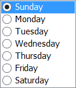
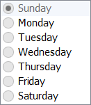
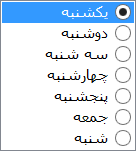
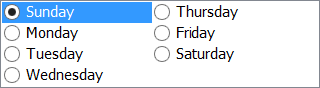

# RadioButtonList Control for Windows Forms

Sometimes you want to group radio buttons to let the user select between some options. In case of grouping radio buttons, it's enough to put them into a container, then they will act like a group. But some times you need data-binding and you want to have radio buttons for all available options which comes from database or an enum. If you need data-binding like how a `ComboBox` or `ListBox` or `CheckedListBox` works, you need a `RadioButtonList` control.

Windows forms doesn't have a built-in `RadioButtonList` control, but you can create your own control by deriving form `ListBox` and making it owner-draw and draw radio buttons yourself. This is the way which `CheckedListBox` is created as well. 

This way, the control supports data-binding and will benefit from all features of `ListBox`, including `DataSource`, `SelectedValue`, `DisplayMember`, `ValueMember` and so on. For example you can simply use it this way:

    this.radioButtonList1.DataSource = peopleTable; 
    this.radioButtonList1.DisplayMember = "Name"; 
    this.radioButtonList1.ValueMember= "Id";

Or for example for an `enum`, simply this way:

    this.radioButtonList1.DataSource = Enum.GetValues(typeof(DayOfWeek)); 

In below images, you can see a LTR `RadioButtonList`. The second `RadioButtonList` is disabled by setting `Enabled = false;`:

Also the control supports right to left as well:

It also supports multi column:

You can use it like a normal `ListBox` by adding items or setting data source with/without using data-binding.